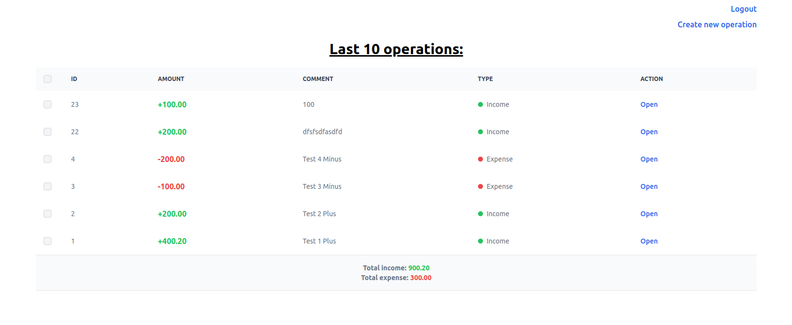
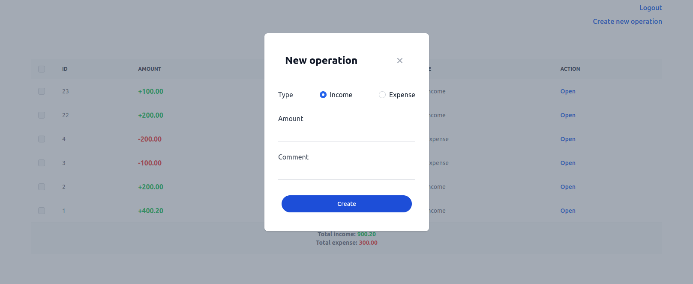
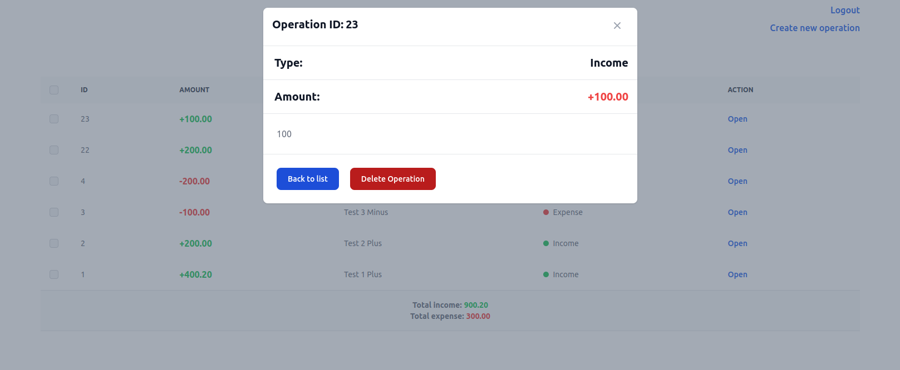

# Simple SPA
## Description

Specifics:
- Simple SPA page
- Front is written in Vanilla JS. Styled using Tailwind CSS
- Backend is run in Docker container (Nginx, PHP with no frameworks, MySQL)
- Operations list (income/expense) with last 10 entities
- Possibility to create new operation
- Possibility to view/delete specific operation
- Access to is restricted only for authorized users except for login and register
- Some basic security safeguards (SQL injections, etc)
- Database is prefilled with some operations and test user for instant usage

Back-end: 
- PHP 8.1 (no frameworks)
- MySQL 8
- Nginx
- Docker

Front-end:
- Vanilla JavaScript
- Tailwind CSS

## Setup process
1. Create a folder we want to use for this project
2. Enter inside created folder using terminal
3. Clone the project into the folder with:
    
    `git clone git@github.com:ionov-e/spa-php-finance.git .`
4. Copy and rename copy of **.env.example** to **.end**
5. `composer install`
6. `chmod 775 logs/`
7. `sudo chown :www-data logs`
8. `docker compose up -d`
9. Visit http://localhost:55000/finance.php
10. You can log in with **test** both as login and password. Or register a new user

## Appearance

